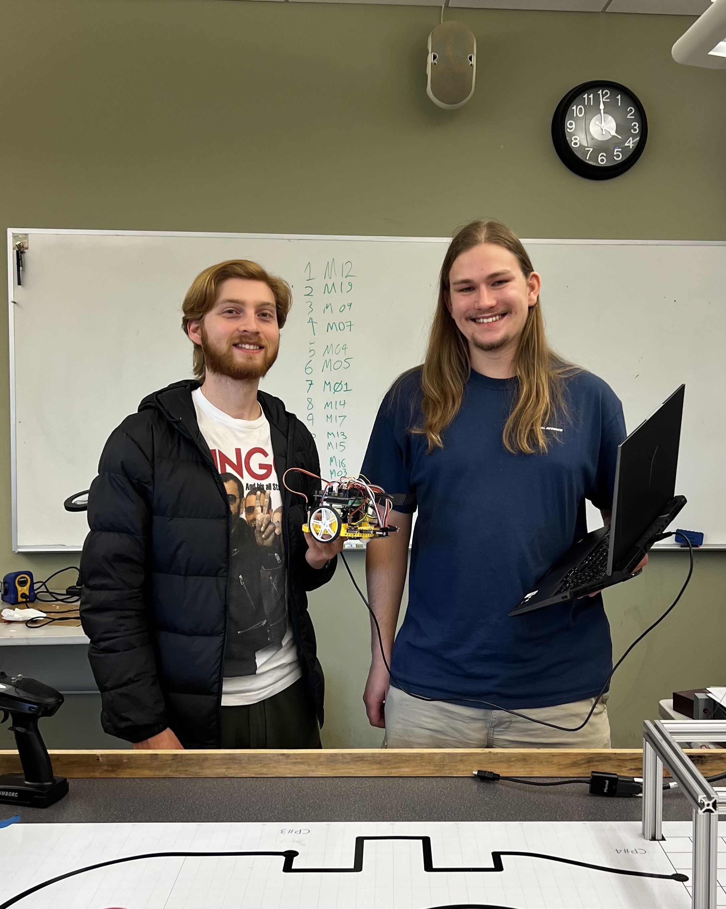

Mechatronics Term Project Documentation
===================================

This portfolio documents the initial challenge, solution process, implementation,
and results of our ME-405 Mechatronics term project.

The path following that our robot displays was a culmination of many sub-tasks 
designed over the course of one quarter, from our :doc:`PID` method to :doc:`state-estimation`,
building together to work with out :doc:`waypoint-seeking` algorithm.

This implementation and design method allows our robot to follow any path, with waypoints
specified with position, speed, and targeted times. This makes our system easily adaptable
given target states on a path.

Contents
--------

.. toctree::
   :maxdepth: 1

   background
   PID
   communication
   line-sensing
   state-estimation
   waypoint-seeking
   results
