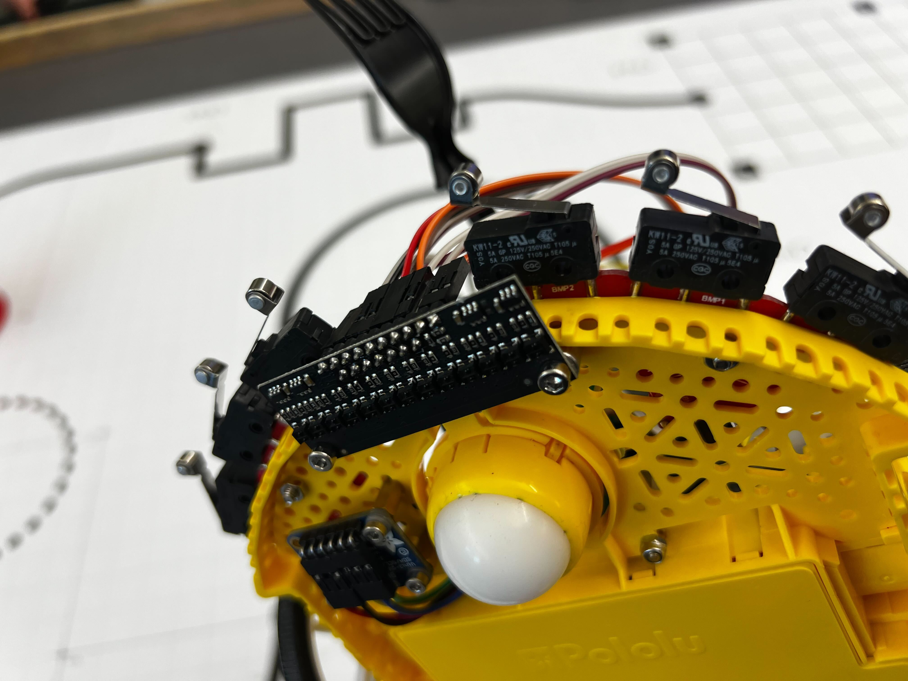

Line Sensing Task
=================

Overview
--------

As the course that our robot navigates uses black lines on a white background
to show the path that we must take, our group mounted an 11-Channel, 4mm Pitch, Analog
infrared sensor array on the front of our robot. `Link to Product <https://www.pololu.com/product/4411>`__

This sensor array allowed us to take readings of line presence, weight, and position within the 44mm
span of the array. 

Our readings from all 11 channels were normalized from calibration values on the range of 0-1.
This then allowed us to find the centroid and average value of the entire array, giving us line 
position and magnitude of presence. If the average value of the normalized sensor readings was below
the threshold of 15% (experimentally determined), yaw rate requests would not be sent, causing the 
robot to carry on in a straight line.

The line sensor centroid readings and average value are calculated as shown below::

    #find centroid and weight
        total = 0
        weighted = 0
        for i in range(self.num_chan):
            total+=self.norm_vals[i]
            weighted+=self.norm_vals[i]*(i-((self.num_chan-1)/2))*(spacing)
        self.centroid = -weighted / total
        return self.centroid, self.average

Calibration Process
-------------------

In order to set calibration values for white and black, our robot was placed over a pure white
and pure black sheet, recording individual sensor values. These calibration values were recorded
for future use, allowing use of the line sensor between resets as long as lighting conditions between
runs remained consistent. The values used for our final test are as follows::

    self.black_cal=[3460.3,3192.7,3295.1,3134.9,2442.8,2336.0,2034.7,2531.2,1555.3,1919.8,2838.7]
    self.white_cal=[1806.9,1514.5,1787.5,1505.5,1124.1,625.9,483.7,804.1,332.0,664.9,1461.6]

While all sensor channels were pointing at the same surface, their individual values varied significantly
between eachother. Without calibration, the overall centroid would be wildly off.

Next, to find the normalized values of each of these channels, the following code was run, comparing the channel
reading to its calibration value on both white and black::

    #interpolate with raw vals, white cal, and black cal
    for i in range(self.num_chan):
    self.norm_vals[i] = (self.avg_vals[i] - self.white_cal[i]) / (self.black_cal[i]-self.white_cal[i])

Yaw Rate Request
----------------

After finding the measured centroid position from our line sensor, we wanted our robot to be able to path toward
this consistently, quickly, and without too much oscillatory behavior. 
This is where our line-sensor :doc:`PID` was involved. We used our PID class to tune yaw rate requests from our
centroid position, only needing position and integral control to achieve reliable responses.

Code
----

Line sensor task::

    import IRSensor
    import PID
    from math import atan
    
    S_WAIT=0
    S_CALW=1
    S_CALB=2
    S_READ=3

    sensor_radius = 75 #closest distance from center of romi to sensor mm

    class Line_Sensor:

        def __init__(self, shares):
            self.omega_req, self.ir_cal_flg, self.follow_flg, self.psidot_kP, self.psidot_kI = shares
            self.state=S_WAIT
            self.cal_timer = 1000
            self.sensor = IRSensor.IRSensor(self.omega_req)
            self.ndebug = 20
            self.omega_controller = PID.PID(0, self.psidot_kP.get(), 0, 0, 0)
            self.transition_to_wait=True

        def run(self, shares):
            while True:
                
                if self.ir_cal_flg.get() == 1:
                    self.state = S_CALW
                    print("White Calibration State")
                elif self.ir_cal_flg.get() == 2:
                    self.state = S_CALB
                    print("Black Calibration State")
                elif self.follow_flg.get()==1:
                    self.state=S_READ
                else:
                    self.state = S_WAIT
                
                if self.state == S_WAIT: #----------------State 0--------------------
                    if self.transition_to_wait:
                        #self.omega_req.put(0)
                        self.transition_to_wait=False

                elif self.state == S_CALW: #----------------State 1--------------------
                    self.sensor.calibratewhite()
                    print("White Calibrated")
                    self.ir_cal_flg.put(0)
                
                elif self.state == S_CALB: #----------------State 2--------------------
                    self.sensor.calibrateblack()
                    print("Black Calibrated")
                    self.ir_cal_flg.put(0)

                elif self.state == S_READ:#----------------State 3--------------------
                    self.sensor_reading, self.average = self.sensor.update_vals()
                    self.angle = atan(self.sensor_reading / sensor_radius)
                
                    self.omega_controller.update_params(self.psidot_kP.get(), self.psidot_kI.get(),0)
                    
                    if self.average >= 0.15: # 0.2 for circle, 0.1 for big sheet
                        self.omega_req.put(self.omega_controller.output(self.sensor_reading))
                    else:
                        self.omega_req.put(0)

                    if self.ndebug <= 0:
                        print(f"Centroid: {self.sensor_reading}, Angle: {self.angle}, Average: {self.average}")
                        print(f"Omega req: {self.omega_req.get()}")
                        self.ndebug = 20
                    self.ndebug -= 1
                    self.transition_to_wait=True
                yield

IR sensor hardware driver code::

    from pyb import Pin, Timer, ADC 
    import array
    samples = 10
    spacing = 4 #mm

    class IRSensor:
        def __init__(self, omega_req):
            self.channels=[ADC(Pin("PC1", mode=Pin.ANALOG)),
                        ADC(Pin("PC0", mode=Pin.ANALOG)),
                        ADC(Pin("PC3", mode=Pin.ANALOG)),
                        ADC(Pin("PC2", mode=Pin.ANALOG)),
                        ADC(Pin("PB0", mode=Pin.ANALOG)),
                        ADC(Pin("PB1", mode=Pin.ANALOG)),
                        ADC(Pin("PA5", mode=Pin.ANALOG)),
                        ADC(Pin("PA6", mode=Pin.ANALOG)),
                        ADC(Pin("PA7", mode=Pin.ANALOG)),
                        ADC(Pin("PC4", mode=Pin.ANALOG)),
                        ADC(Pin("PC5", mode=Pin.ANALOG))]
            self.num_chan=len(self.channels)
            self.raw_vals=[array.array('H', (0 for i in range(samples))),
                        array.array('H', (0 for i in range(samples))),
                        array.array('H', (0 for i in range(samples))),
                        array.array('H', (0 for i in range(samples))),
                        array.array('H', (0 for i in range(samples))),
                        array.array('H', (0 for i in range(samples))),
                        array.array('H', (0 for i in range(samples))),
                        array.array('H', (0 for i in range(samples))),
                        array.array('H', (0 for i in range(samples))),
                        array.array('H', (0 for i in range(samples))),
                        array.array('H', (0 for i in range(samples)))]
            self.norm_vals = [0.0 for i in range(self.num_chan)]
            self.omega_req = omega_req
            self.sample_flg = 0
            self.tim=Timer(15, freq=1000)
            self.black_cal=[3460.3,3192.7,3295.1,3134.9,2442.8,2336.0,2034.7,2531.2,1555.3,1919.8,2838.7]
            self.white_cal=[1806.9,1514.5,1787.5,1505.5,1124.1,625.9,483.7,804.1,332.0,664.9,1461.6]
            self.centroid=0
            self.white_average = 0
            self.black_average = 2000

        def run(self):
            while True:
                if self.sample_flg >=1:
                    self.update_vals
                yield

        def calibratewhite(self):
            ADC.read_timed_multi(self.channels,self.raw_vals, self.tim)

            self.white_cal = [sum(vals)/samples for vals in self.raw_vals]
            self.white_average = sum(self.white_cal) / self.num_chan

            # Calibrate white and black
            print(f"White Cal Values: {self.white_cal}")
            return
        
        def calibrateblack(self):
            ADC.read_timed_multi(self.channels,self.raw_vals, self.tim)

            self.black_cal = [sum(vals)/samples for vals in self.raw_vals]
            self.black_average = sum(self.black_cal) / self.num_chan

            # Calibrate white and black
            print(f"Black Cal Values: {self.black_cal}")
            return
        
        def update_vals(self):
            ADC.read_timed_multi(self.channels,self.raw_vals, self.tim)

            self.avg_vals = [sum(vals)/samples for vals in self.raw_vals]
            self.average = sum(self.avg_vals) / self.num_chan
            self.average = (self.average - self.white_average) / (self.black_average - self.white_average)

            #interpolate with raw vals, white cal, and black cal
            for i in range(self.num_chan):
                self.norm_vals[i] = (self.avg_vals[i] - self.white_cal[i]) / (self.black_cal[i]-self.white_cal[i])

            #find centroid and weight
            total = 0
            weighted = 0
            for i in range(self.num_chan):
                total+=self.norm_vals[i]
                weighted+=self.norm_vals[i]*(i-((self.num_chan-1)/2))*(spacing)
            self.centroid = -weighted / total
            return self.centroid, self.average
