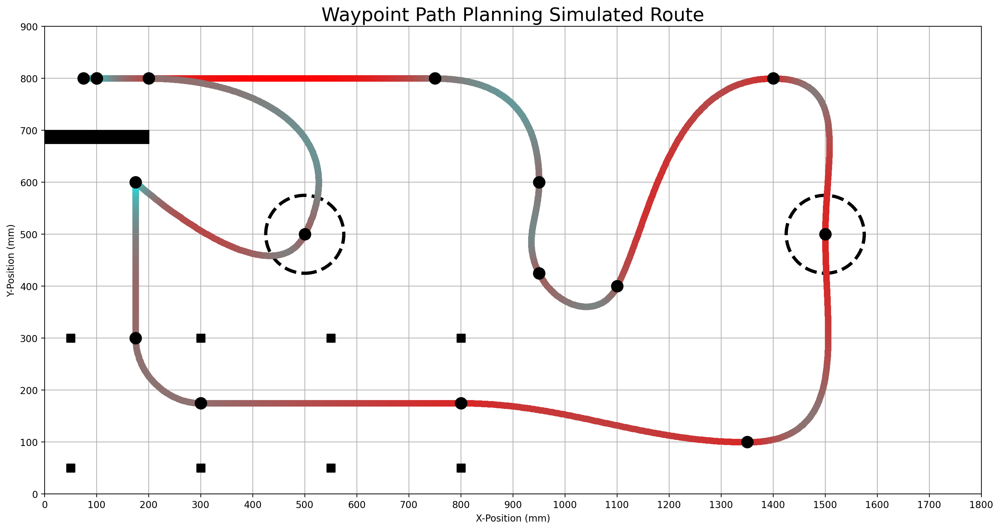

Waypoint Seeking
================

Waypoints are shown below::

    self.waypoints = [[750,800,200,0,2.5],      # End of start line
                    [950,600,0,-200,2],             # "Line following" complete
                    [950,425,100,-200,1],           # CP1
                    [1100,400,100,200,0.75],        # Smooooth turn
                    [1400,800,300,0,2],             # CP2
                    [1525,500,0,-300,1.5],          # Cone 1
                    [1350,100,-300,0,1.75],         # CP3
                    [800,125,-300,0,2],             # CP4
                    [300,100,-200,0,2],             # Dont hit the garage
                    [200,300,0,200,1],              # CP5
                    [200,450,-20,0,3],              # Wall
                    [200,450,0,0,3],                # Wall 2: wall's revenge
                    [500, 450,100,200,4],           # Cone 2
                    [200,800,-200,0,2],             # Don't hit the wall
                    [100,800,-200,0,2],             # CP6
                    [75,800,0,0,.5]]                # Stop here

Pretty cool! I should turn this into a table